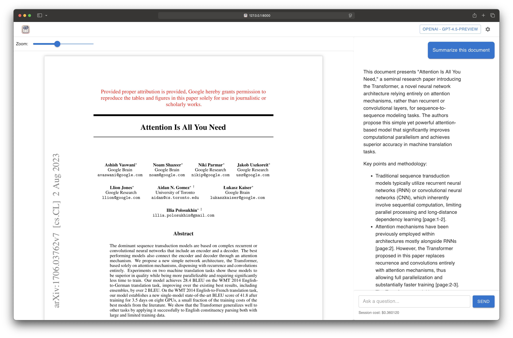

# DeepRead

A desktop application for reading and analyzing PDFs with LLM support.



## Overview

DeepRead helps you get more from your PDF documents by combining a clean reading experience with AI-powered analysis. With DeepRead, you can:
- Read PDF documents in a distraction-free interface
- Chat with AI about document content to gain deeper insights
- Extract and process text from complex PDFs

## Installation

### Option 1: Install via pip

```bash
pip install deepread
```

After installation, launch the application with:

```bash
deepread serve
```

The server will start at http://127.0.0.1:8000 by default.

### Option 2: Download desktop application

Pre-built desktop applications are available for:
- Windows
- macOS
- Linux

Download the latest version from our [Releases](https://github.com/yourusername/DeepRead/releases) page.

## Development

For local development, you can run:

```bash
# Start the frontend and backend for web development
npm run dev:web

# Start with Electron support
npm run dev:electron
```
